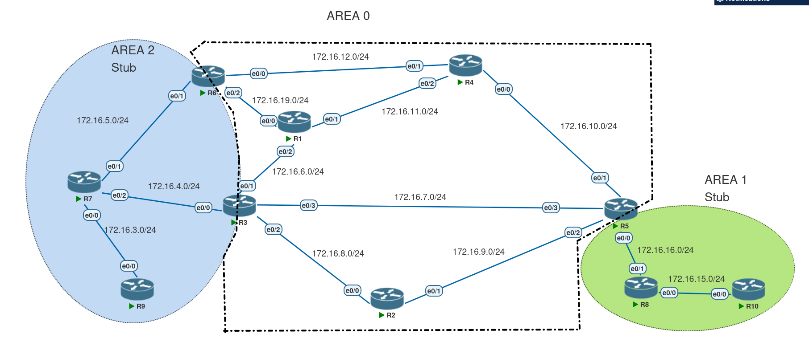

# OSPF — Authentication



---

## Overview
- The **goal** is to protect the OSPF control plane from **route injection attacks**.  
- Every OSPF packet header (Hello, LSU, LSR, etc.) includes authentication information.  
- **Authentication ≠ Encryption**  
  - OSPFv2 only supports **authentication**.  
  - **Encryption** was added in OSPFv3 using **IPsec**.  

---

## OSPF Authentication Types
- **Type 0** → Null  
- **Type 1** → Simple password  
- **Type 2** → MD5 / SHA  

---

## Implementation of Authentication
Authentication can be configured in **two ways**:

1. **Global process level**  
2. **Interface (link) level**  

Notes:
- If enabled at the **link level**, it **overrides** the global process configuration.  
- Regardless of configuration method, the **password** must be applied under the **interface**.  
- In **Type 2 (MD5/SHA)**, **Key IDs must match**, otherwise adjacency will fail.  
- Best practice: enable authentication only on **transit interfaces**, not on **loopbacks or access links** (declare those as **passive interfaces**).  

---

## Virtual Link Authentication
- Same rules apply as physical interfaces.  
- Virtual link is treated as an **interface**: key goes under the virtual link, type can be configured globally or per-interface.  
- Always **flap the link** after enabling authentication — virtual links run as **demand circuits**, so changes may not be visible until triggered.  

---

## Configurations

### Clear-Text Authentication
**Interface level**
```bash
int e0/0
 ip ospf authentication
 ip ospf authentication-key <password>
````

**Global process level**

```bash
router ospf 1
 area 0 authentication
```

⚠️ Still need to set the password at the **interface**.

---

### MD5 Authentication

**Interface level**

```bash
int e0/0
 ip ospf authentication message-digest
 ip ospf message-digest-key <key-id> md5 <password>
```

**Global process level**

```bash
router ospf 1
 area 0 authentication message-digest
```

Notes:

* More secure than plain-text: password itself is not sent, only the **hash**.
* MD5 is stronger, but still **not fully secure**.

---

### Virtual Link Authentication

Even with global process configuration, the **password** must be applied under the virtual link:

```bash
router ospf 1
 area 0 authentication message-digest
 area 1 virtual-link <router-id> authentication message-digest
 area 1 virtual-link <router-id> message-digest-key <key-id> md5 <password>
```

---

## Authentication Enhancements

**RFC 5709 — OSPFv2 HMAC-SHA Cryptographic Authentication**

* Introduces stronger algorithms for **Type 2 authentication**:

  1. Keyed-MD5
  2. HMAC-SHA (256, 384, 512)

---

## OSPF Key-Chain Authentication

Like in EIGRP, OSPF can now use **key chains**.

### Benefits

* Multiple keys
* Automatic **time-based key rotation**
* Single key chain can be applied to multiple interfaces
* Backward-compatible with MD5 (Key IDs must still match)

### Configuration

**Create a key chain**

```bash
key chain <name>
 key <n>
  key-string <password>
  cryptographic-algorithm <md5 | hmac-sha-256 | hmac-sha-384 | hmac-sha-512>
```

**Apply to an interface**

```bash
int g0/0
 ip ospf authentication key-chain <name>
```

---

## Verification

* Check the key chain:

```bash
show key chain
```

* Verify OSPF authentication per-interface:

```bash
show ip ospf interface g0/0
```


