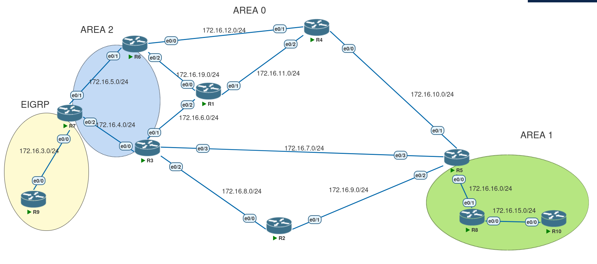

# Ospf Route Filtering

## OSPf Type-3 Lsa Filtering 
* Applied on the ABR and filters the desiered Inter-Area Lsa's using this command:
```
area x filter-list prefix <name> in|out
```
  in :  Filter networks sent to this area

  out : Filter networks sent from this area

**forexample :**

``area 1 filter-list prefix Area-1-out out``
* in this example the we are filtering lsa's from area 1 going to area 0
* because of ospf spine_leaf architecture , area 0 is always involved in the filtering.

* filter-list uses prefix lists for classification 
* unlike summarization, an abr can filter out Lsa type-3 that it does not have visibility to (it does not have its type-1 in its lsdb)

* this command does not effect lsa type-5


---


lets say in this topology we want to filter out, the transit links of Area 2 from goining to area 1:
specifically :
```
172.16.1.0/24
172.16.2.0/24
172.16.3.0/24
172.16.4.0/24
172.16.5.0/24
```

**R8's Rib before filtering**
```
R8#sh ip route ospf 

      50.0.0.0/32 is subnetted, 1 subnets
O IA     50.50.50.50 [110/11] via 172.16.16.5, 13:20:42, Ethernet0/1
      172.16.0.0/16 is variably subnetted, 23 subnets, 2 masks
O IA     172.16.1.0/24 [110/50] via 172.16.16.5, 13:20:42, Ethernet0/1
O IA     172.16.2.0/24 [110/50] via 172.16.16.5, 13:20:42, Ethernet0/1
O IA     172.16.3.0/24 [110/40] via 172.16.16.5, 13:20:42, Ethernet0/1
O IA     172.16.4.0/24 [110/30] via 172.16.16.5, 13:20:42, Ethernet0/1
O IA     172.16.5.0/24 [110/40] via 172.16.16.5, 13:20:42, Ethernet0/1
O IA     172.16.6.0/24 [110/30] via 172.16.16.5, 13:17:57, Ethernet0/1
O IA     172.16.7.0/24 [110/20] via 172.16.16.5, 13:17:57, Ethernet0/1
...
...
...
```

**no on R5 :**
```
R5#sh ip prefix-list 
ip prefix-list p1: 6 entries
   seq 5 deny 172.16.1.0/24
   seq 10 deny 172.16.2.0/24
   seq 15 deny 172.16.3.0/24
   seq 20 deny 172.16.4.0/24
   seq 25 deny 172.16.5.0/24
   seq 30 permit 0.0.0.0/0 le 32
R5#
```
```
R5(config-router)#area 0 filter-list prefix p1 out 
```

**R8's Rib after filtering**

```
R8#sh ip route ospf 

      50.0.0.0/32 is subnetted, 1 subnets
O IA     50.50.50.50 [110/11] via 172.16.16.5, 13:24:06, Ethernet0/1
      172.16.0.0/16 is variably subnetted, 18 subnets, 2 masks
O IA     172.16.6.0/24 [110/30] via 172.16.16.5, 13:21:21, Ethernet0/1
O IA     172.16.7.0/24 [110/20] via 172.16.16.5, 13:21:21, Ethernet0/1
```
**!** we should have the ``permit 0.0.0.0/0 le 32`` at the end of the prefix-list to allow the advertisement of other lsa type 3 prefixes .

---

## Filtering Lsa type-5 
* Its done on the Asbr at the time of redistribution using a route-map
* then it can not be filtered except with stub area's



* lets say in this topology 
we want to redistribute all the eigrp prefixes into ospf domain except for the link R2&R9 ``2.9.2.0/24``.

**R7' Eigrp prefixes:**
```
      2.0.0.0/24 is subnetted, 1 subnets
D        2.9.2.0 [90/1536000] via 172.16.3.9, 00:00:00, Ethernet0/0
      172.16.0.0/16 is variably subnetted, 22 subnets, 2 masks
D        172.16.1.0/24 [90/1536000] via 172.16.3.9, 00:01:03, Ethernet0/0
D        172.16.2.0/24 [90/1536000] via 172.16.3.9, 00:01:03, Ethernet0/0
      198.22.10.0/32 is subnetted, 10 subnets
D        198.22.10.9 [90/1024640] via 172.16.3.9, 00:01:03, Ethernet0/0
R7#
```
 **R7 Configuration**
```
R7#sh ip prefix-list p1
ip prefix-list p1: 2 entries
   seq 5 deny 2.9.2.0/24
   seq 10 permit 0.0.0.0/0 le 32
R7#
```

```
R7#sh route-map r1
route-map r1, permit, sequence 10
  Match clauses:
    ip address prefix-lists: p1 
  Set clauses:
  Policy routing matches: 0 packets, 0 bytes
R7#
```

```
R7(config-router)#redistribute eigrp 1 subnets route-map r1
```

**R6 rib**
```
R6#sh ip route | in E1|E2
       E1 - OSPF external type 1, E2 - OSPF external type 2
O E2     172.16.1.0/24 [110/20] via 172.16.5.7, 00:00:36, Ethernet0/1
O E2     172.16.2.0/24 [110/20] via 172.16.5.7, 00:00:36, Ethernet0/1
O E2     172.16.3.0/24 [110/20] via 172.16.5.7, 00:00:36, Ethernet0/1
O E2     198.22.10.9 [110/20] via 172.16.5.7, 00:00:36, Ethernet0/1
R6#
```
* Filtering Type-7 lsa is the same approach as here 
---

## Filtering translated type-5 lsa 
* as discussed in the nssa section, its done using by ``nssa-only`` keyword either with the ``redistribution`` command or using the ``summary-address`` command .
*on most devices we can not filter on the Abr, except ios-xe/nx-os, we can use this command :
``area x nssa translate type 7 route-map <name>``

