# OSPF — Controlling exit points from a stub area


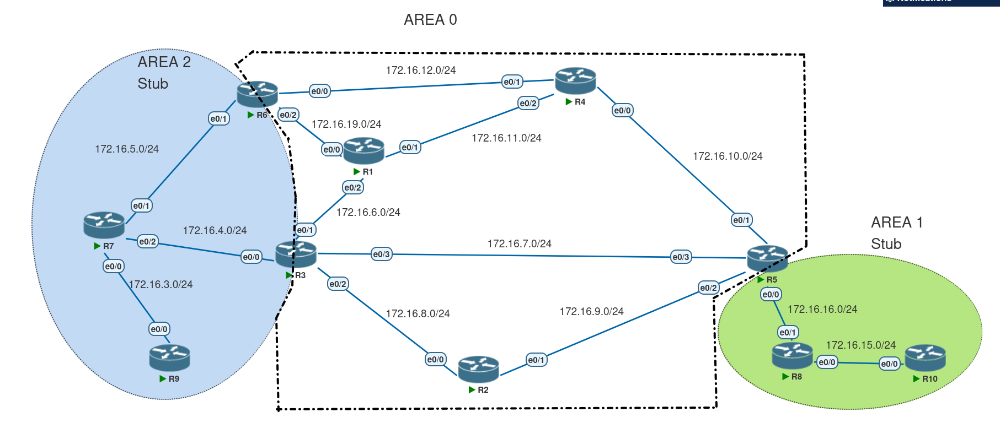

## Goal

In the topology above there are **two ABRs (R3 and R6)** between **Area 2 (stub)** and **Area 0**. Routers inside the stub (for example R7) will receive a **default route** (LSA Type-3) injected by the ABR(s). The objective is to **control which ABR is used as the exit point** for different kinds of traffic (inter-area vs. external), or force a single exit point for all traffic.

here is the current routing table of R7 :

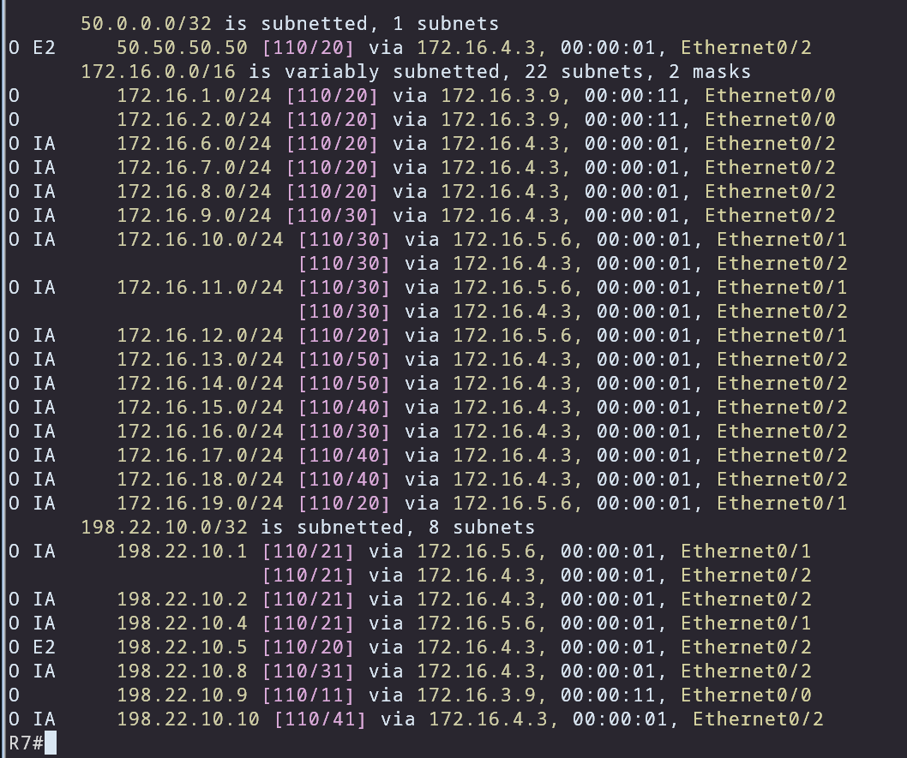

---

## Method 1 — Choose a single path by adjusting default-route metrics

**Idea:** The ABR advertises the default (Type-3) with a metric. The router inside the stub chooses the best path by comparing `ABR_default_metric + cost_to_ABR`. So change either the ABR’s default metric or the IGP cost to the ABR.

**Options**

* On the ABR that generates the default :

  ```
  router ospf 1
    area 2 default-cost <cost>    ! sets the metric that this ABR uses for the injected default (Type-3)
  ```
* On the stub router (or any interface) change interface cost:

  ```
  interface e0/1
    ip ospf cost <value>
  ```

  *This reduces/increases the router’s cost to its ABR.*

**Effect / Calculation**
Let:

* `a` = metric R3 uses for its default
* `b` = cost from R7 to R3
* `x` = metric R6 uses for its default
* `y` = cost from R7 to R6

R7 will pick R6’s default if `x + y < a + b`.
If you want R3 as the chosen exit, set `a + b` smaller than `x + y`.

**What to check**

* `show ip ospf database summary 0.0.0.0`  — we can see the summary and metric as generated by each ABR.
* `show ip route` on R7 to see which 0.0.0.0/0 is installed.


**Example**
To prefer R3:

* On R6:

  ```
  router ospf 1
    area 2 default-cost 100   ! make R6 default expensive
  ```
* Or on R7:

  ```
  interface e0/1
    ip ospf cost 100  ! increase cost to R6
  ```

---

## Method 2 — Choose exit by traffic *type* (inter-area vs external)

**Idea:** in a  more complex design we can choose the exit point by the traffic type , since in igp the attributes are the function of the link not the path we can not choose them by the actual prefix , but we can use the difference of the Lsa type 5 vs type 3.

**How**

lets say we want our inter area routes (lsa 3) to go through R3 and our inter area external traffic (lsa 5) through R6
	we can use the difference in the calculation of the lsa 3 vs lsa 5.
	for inter area traffic its not simple to change the cost of the Abr to get to those routes, so we change the cost to get to the Abr.
	so we increase the cost of getting to R6 by the ip ospf cost command on R7 interface 

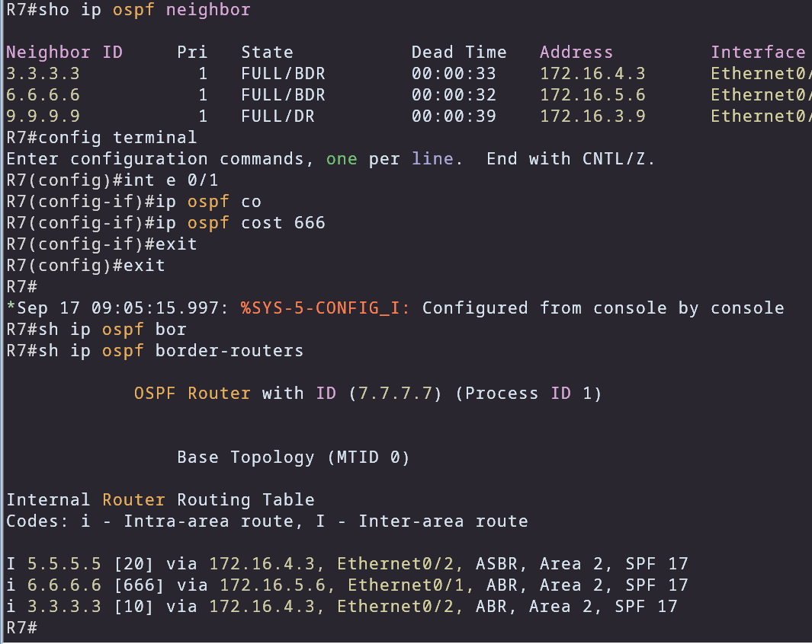

for inter area external routes :
		the calculation for Lsa type 5 is either type 1 vs type 2 (default is type 2)
	type two is just the metric that the generating router(ASBR) has advertised 
	type one also considers the cost to Asbr .

we have to change the cost of the default route in the way that it does not effect lsa 3 :
we would change the default route itself on the Abr :
but we have to remember this :

* `a` = metric R3 uses for its default
* `b` = cost from R7 to R3
* `x` = metric R6 uses for its default
* `y` = cost from R7 to R6
			
			in order to use the R6's default route in the rib :
				x + y < a + b
			or if we want to use both of the default routes :
				x + y = a + b

in this case :

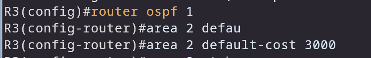

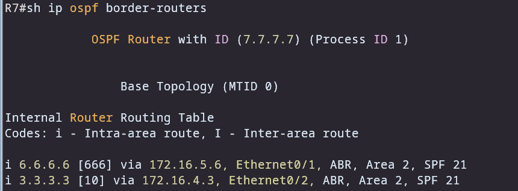

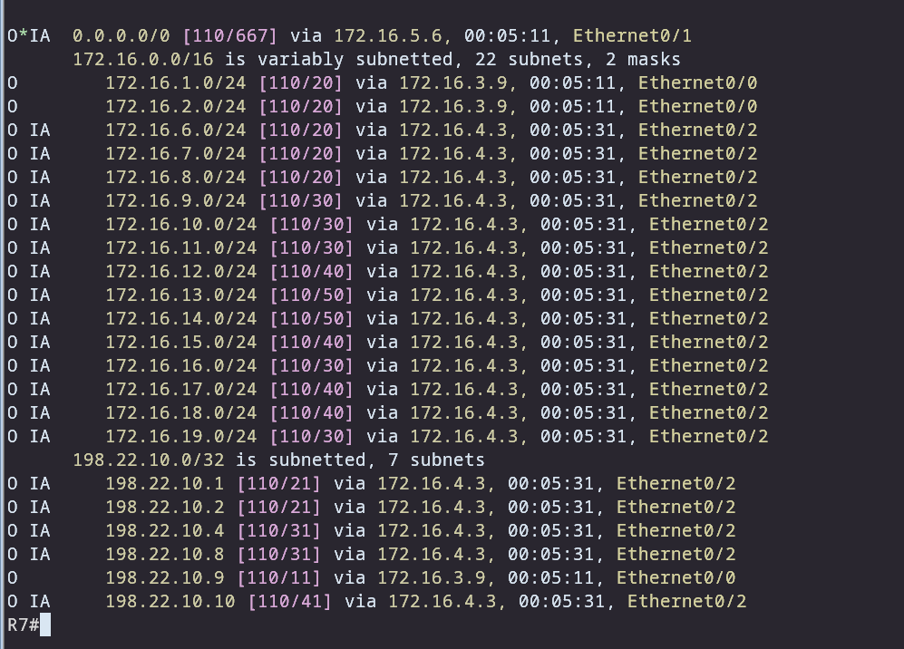

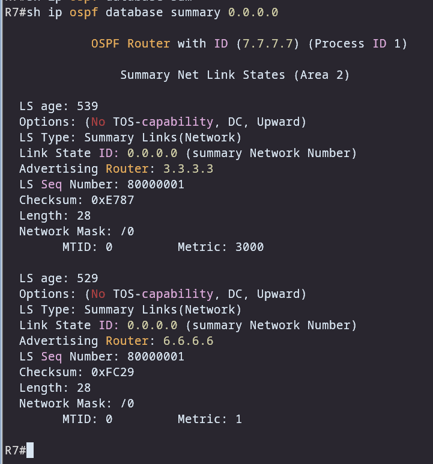

666 + 1 < 10 + 3000 therefore doe the default route R6 would be choosen with the metri of 667
but for the inter area routes R3 would be choosen because of the 556 less cost in contrast to R6 

---

## Method 3 — Force by longest-prefix / filtering (totally stubby + longest match)

**Idea:** Use OSPF area filtering (totally stubby) and longer prefixes so that routers inside the area have no choice for some prefixes (they must use the ABR that advertises them).

**Techniques**

* **Totally stubby area** (on ABR): prevents Type-3 summary LSAs (except the default) from being flooded into area — the area gets only a default. 

  ```
  router ospf 1
    area 2 stub no-summary   ! makes area 2 totally stubby (no type-3 summaries except default)
  ```
* **Use more specific prefixes**: If one ABR (say R3) advertises /24s for internal destinations (or summarizes differently), routers in the stub will use the most specific route (longest match). If R6 does not advertise those specific prefixes (because totally stubby or because it has them filtered) then R7 will be forced to use R3.

**Use case in this scenario**

on R3 we would increase the default route cost or we can increase the cost to get to R3, 
then on R6 we would declare it as totally stubby area which would filter out also the type 3 lsa.
		
even though the cost to R3 is higher, since its the only router that advertises the prefixes R7 has no choice to choose R3 for its inter area routes.

and for inter area external routes since R3 has higher metric for the default route, then R7 would choose R6's default route .

**configuration :**
before :
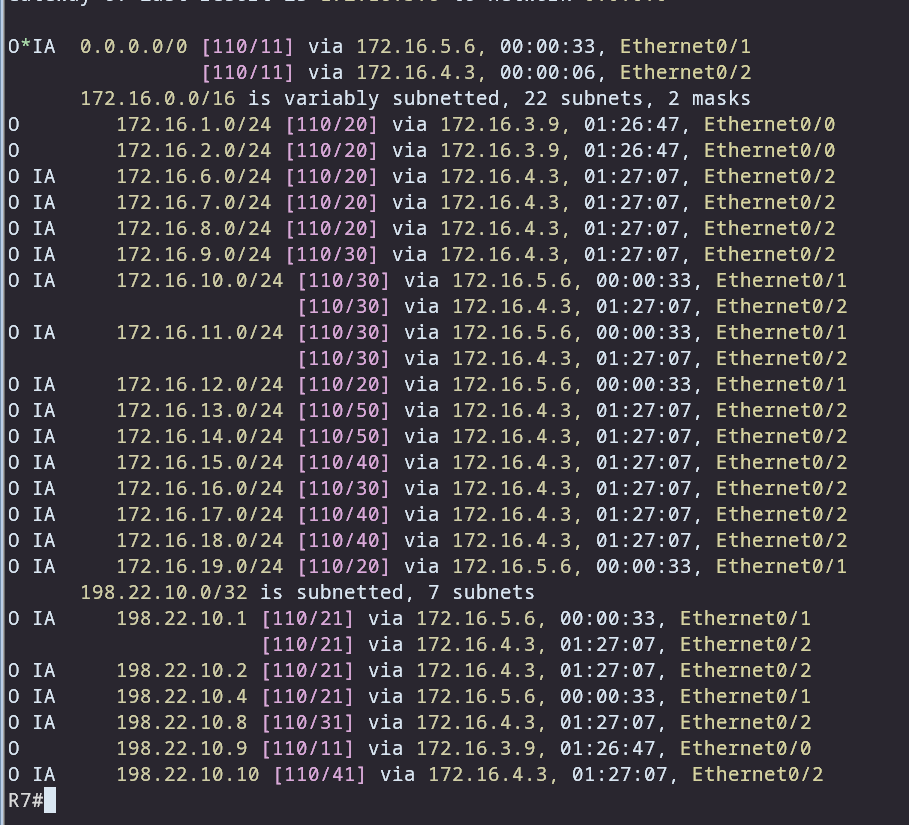

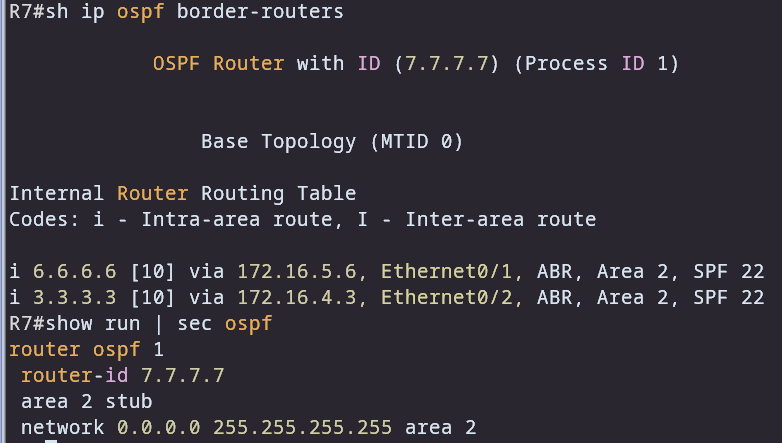

changing the config on R7 and R6 :

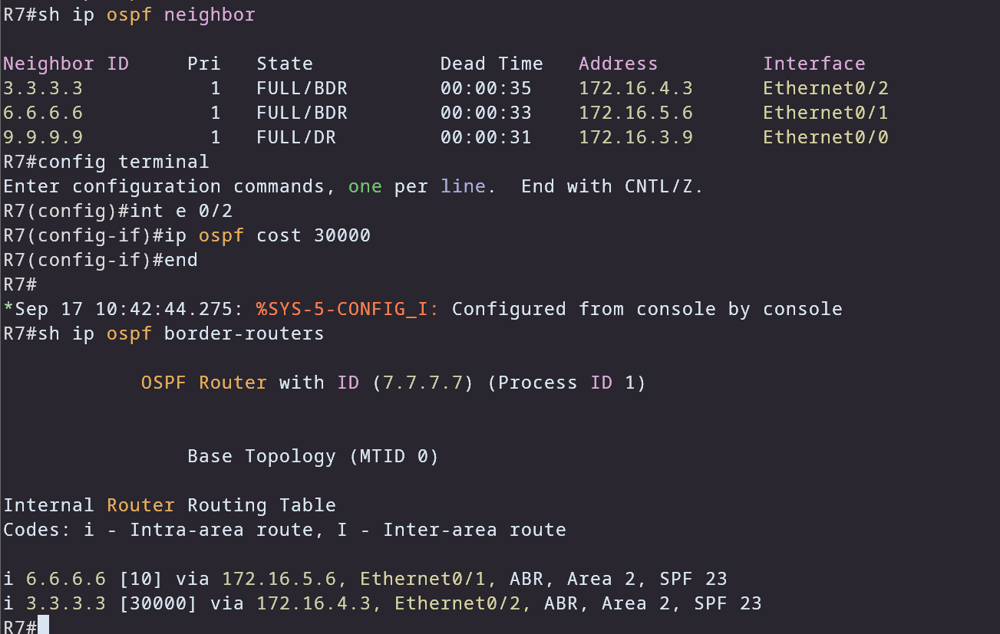

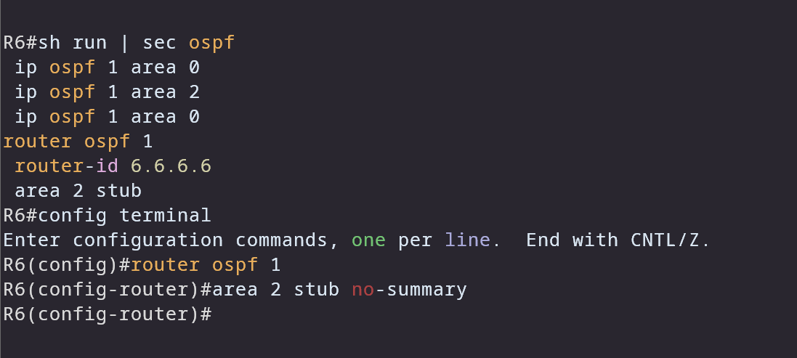

result :

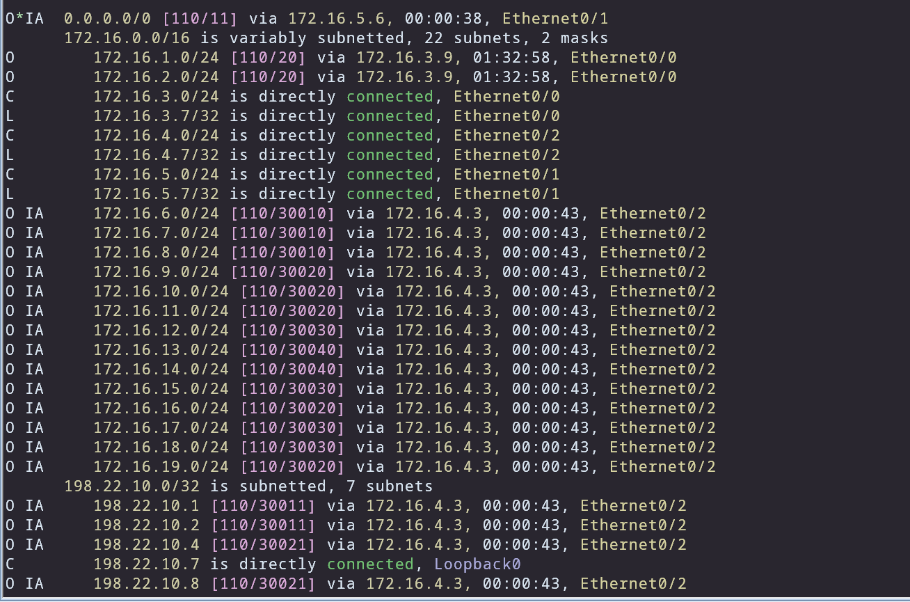


**What to check**

* `show ip ospf database summary` — the presence/absence of Type-3 LSAs.
* `show ip ospf interface` and `show ip ospf` to confirm ABR/stub behavior.
* `show ip route` to confirm prefix installation.

---


---

## Gotchas & best practices

* Changing **interface costs** affects all traffic using that interface — ensure you don’t inadvertently alter other paths.
* `area <id> default-cost` only adjusts the **metric of the default LSA** injected by the ABR for that area; it does not change other Type-3 LSAs.
* For external routes, remember **metric-type 1 vs 2**: if you want the IGP path to matter, use metric-type 1.
* When using totally-stubby areas, you remove inter-area prefix visibility (except default). Make sure this matches design needs (some hosts may require certain inter-area routes).
* Always test with `show ip route` and `traceroute` from inside the stub to validate the effective forwarding path (data plane).
* Document changes and keep change windows for production; metric fiddling can have widespread effects.

---


