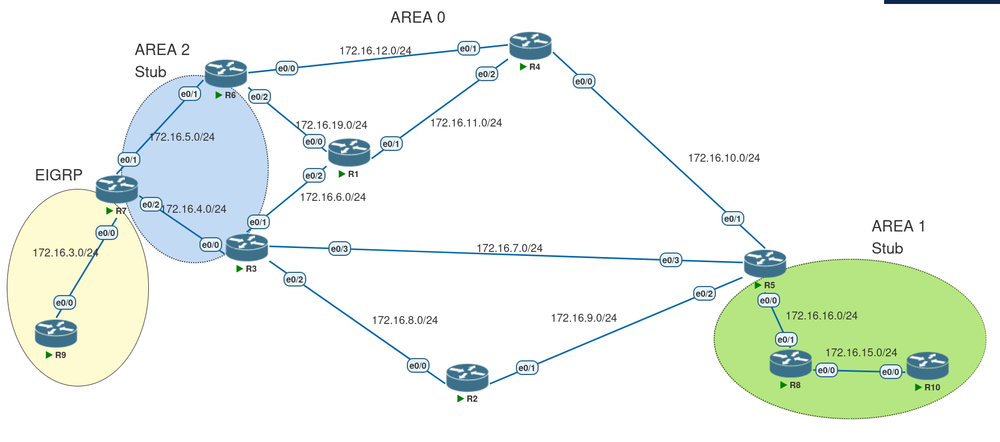

# OSPF Path Selection: E vs N

In OSPF path selection, there is a process that takes precedence over **metric**: it's the **route type**.

For example, OSPF will always prefer an **intra-area** route over an **inter-area** route—even if the metric is higher.

---

##  E vs N Metrics

This section focuses on a confusing but critical part: the difference between **E** and **N** metrics.

* **E** types are created because of **LSA Type 5** (external routes).
* **N** types are created because of **LSA Type 7** (NSSA external routes).

---

###  The Rare Case



In a rare case when the ABR of an NSSA receives a route both from the NSSA and from the external OSPF domain, we can observe the **difference between E and N types**.

What's confusing is that **Cisco devices behave differently depending on which RFC they follow**:

* **RFC 1587**: Devices prefer **E** routes over **N** routes.
* **RFC 3103**: Devices prefer **N** routes over **E** routes.

---

###  Demonstration on R3

Both **R7** and **R2** are advertising a **Type 2 default route**.

To make their metrics equal, the cost of R3’s link to R5 is adjusted.

####  `show ip ospf border-routers` Output:

```plaintext
OSPF Router with ID (3.0.0.0) (Process ID 1)

Base Topology (MTID 0)

Internal Router Routing Table
Codes: i - Intra-area route, I - Inter-area route

i 7.0.0.0 [20] via 172.16.4.7, Ethernet0/0, ASBR, Area 2, SPF 17
i 6.0.0.0 [30] via 172.16.4.7, Ethernet0/0, ABR/ASBR, Area 2, SPF 17
i 6.0.0.0 [30] via 172.16.7.5, Ethernet0/3, ABR/ASBR, Area 0, SPF 5
i 5.0.0.0 [10] via 172.16.7.5, Ethernet0/3, ABR/ASBR, Area 0, SPF 5
i 2.0.0.0 [20] via 172.16.7.5, Ethernet0/3, ASBR, Area 0, SPF 5
```

####  When Using RFC 1587:

```plaintext
Gateway of last resort is 172.16.7.5 to network 0.0.0.0

O*E2  0.0.0.0/0 [110/1] via 172.16.7.5, 00:00:00, Ethernet0/3
                [110/1] via 172.16.4.7, 00:00:00, Ethernet0/0
```

The E2 route via R2 is preferred.

####  When Using RFC 3103:

```plaintext
Gateway of last resort is 172.16.4.7 to network 0.0.0.0

O*N2  0.0.0.0/0 [110/1] via 172.16.4.7, 00:01:28, Ethernet0/0
```

Now the N2 route via R7 is preferred.

#### how preference evolved :

| Time period | Standard / IOS mode                  | Preferred Type‑1 on equal cost  |
| ----------- | ------------------------------------ | ------------------------------- |
| Pre‑2003    | RFC 1583 with legacy code            | **E1** (fixed)                  |
| \~2003‑2013 | RFC 3101 standard                    | **E1 wins on exact metric‑tie** |
| 2014→ today | Cisco IOS ≥ 15.1(2)S (no RFC buckle) | **N1** (due to path order)      |

### configuration :
we would use the compatible command to make changes :
```bash
router ospf 1
  compatible rfc1587
```

#### here are different RFC's that ospf support and the difference between each :

| RFC Compatibility Mode       | E1 vs N1 (tie)                   | E2 vs N2 (tie)                     | Behavior source                                                            |
| ---------------------------- | -------------------------------- | ---------------------------------- | -------------------------------------------------------------------------- |
| **None** (RFC 3101, default) | N1 before E1                     | N2 before E2                       | Cisco from IOS 15.1(2)S ([NetworkLessons.com][1], [NetworkLessons.com][1]) |
| `compatible rfc1587`         | E1 before N1                     | E2 before N2                       | RFC 1587, legacy Cisco behavior ([NetworkLessons.com][1], [cisco.com][2])  |
| `compatible rfc1583`         | **Same as above** (E1>N1, E2>N2) | Applies only summary metric change | No change to path‑type ordering ([cisco.com][2])                           |
| `compatible rfc5243`         | No effect                        | No effect                          | Only changes DBD handshake behavior ([cisco.com][2])                       |

[1]: https://networklessons.com/ospf/ospf-path-selection-explained?utm_source=chatgpt.com "OSPF Path Selection explained - NetworkLessons.com"
[2]: https://www.cisco.com/c/en/us/td/docs/ios-xml/ios/iproute_ospf/command/iro-cr-book/m_ospf-a1.html?utm_source=chatgpt.com "Cisco IOS IP Routing: OSPF Command Reference"

* it is not recommended to change the RFC mode just to prefer E1 over N1.


#### Design alternatives instead of changing RFC

* If your design really needs E1 to be preferred, you have better tools:

1. Manipulate metrics:
Adjust the external metric-type (E1 adds internal cost, E2 does not) or tweak interface costs so the E1 looks more attractive.
2. Policy-based routing (route-maps):
Use route-maps on redistribution or filtering to prefer certain externals.
3. Tagging / route filtering:
Tag redistributed routes and control which ones are imported where, instead of relying only on path-type preference.

#### Best practice

* Keep RFC 3101 (default) for consistency and standards alignment.
* Don’t change RFC modes just for path preference — use metric tuning or policies instead.
* Only use compatible rfc1587 (or 1583) in legacy migration scenarios where you need to match old routers.
