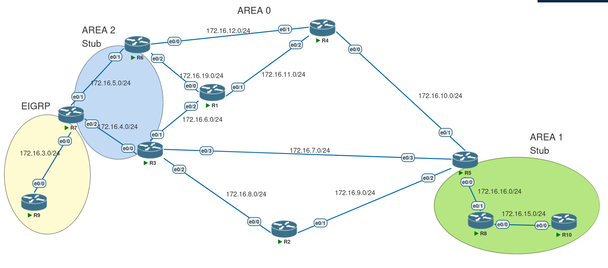

# OSPF — Introduction to NSSA



In this topology, the previously declared **stub area** has a link to another domain (EIGRP in this case), which creates the need for redistribution in the NSSA.  
External routes created inside the NSSA are advertised as **Type-7 LSAs**, which are similar to Type-5 LSAs but with some differences.

---

## Type-7 LSA

### Within the NSSA
- The **ASBR (Router 7)** creates the Type-7 LSA.  
- Type-7 LSAs include a **P-bit (Propagate bit)**:  
  - This bit indicates whether the prefix is allowed to leave the NSSA and be translated into a Type-5 LSA in Area 0.  
- Another difference: the **forwarding address**.  
  - In most Type-5 LSAs, this field is `0.0.0.0`.  
  - In Type-7 LSAs, it is the IP address of the ASBR’s interface.  

### Forwarding Address
- Since Type-5 LSAs are blocked in an NSSA, external routes are advertised as Type-7.  
- If the **P-bit** is set, the ABR that wins the **translation election** translates the Type-7 LSA into a Type-5.  
- The translated Type-5 LSA is slightly different: its **forwarding address is not `0.0.0.0`**.  

This ensures redundancy. For example:
- Suppose R6 wins the election and translates the LSA for `172.16.3.0/24`.  
- If the forwarding address is `0.0.0.0`, routers (like R1) would recurse back to R6 (the advertising router).  
- If the forwarding address is the ASBR’s IP (R7’s interface), other routers could also reach the destination via R3 → R7, even though R3 is not the advertising router.  

### Forwarding Address vs. Advertising Router
- **Advertising Router** = Router-ID of the OSPF node that generated the LSA.  
- **Forwarding Address** = Actual IP address used for forwarding traffic.  

This changes recursion:  

- **Normal external route recursion**:  
  `LSA 5 → LSA 4 → LSA 1`  

- **Translated Type-7 recursion**:  
  `LSA 5 → LSA 3 → LSA 1`

---

## Configuration

On routers that belong to the NSSA (R7, R6, and R3):  

```bash
router ospf 1
  area 2 nssa
