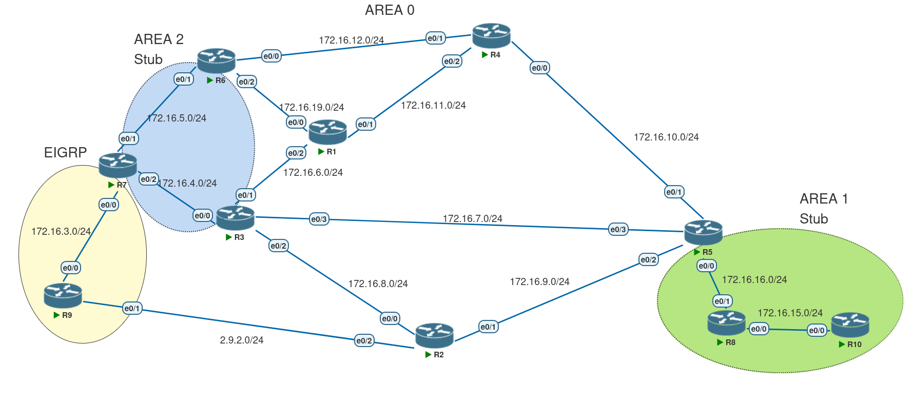
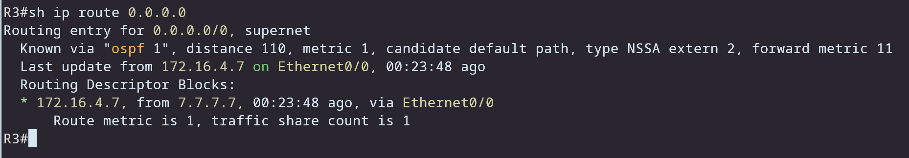

# OSPF — Default routing with NSSA



By default in a NSSA, ABRs **do not** generate a default route for the area. In the topology above there are three ways to provide a default route into the NSSA:

1. Have the ASBR generate/advertise the default route.
2. Configure an NSSA-ABR to originate the default route (Type-7).
3. Configure one of the ABRs to treat the area as a plain NSSA (use `no-summary`) so the ABR generates a Type-3 (summary) default.

These options exist to give flexibility in how OSPF forwards traffic and how defaults are propagated.

> Remember: OSPF will **not** let us redistribute a default route or summarize a default route using redistribution/summarization commands — defaults are handled specially.

---

## Top-level summary of options

* **Option 1 (ASBR originates default)** — ASBR originates a Type-7 default (requires RIB default on ASBR).
* **Option 2 (NSSA ABR originates default)** — ABR originates Type-7 default without needing a RIB default.
* **Option 3 (ABR uses `no-summary`)** — ABR generates a Type-3 summary default (always wins over Type-7).

---

## Option 1 — ASBR originates the default

In our case the ASBR is `R7`. For `R7` to originate a default into OSPF it must have a default in its RIB. You can add a "null" default route to trick OSPF:

```bash
ip route 0.0.0.0 0.0.0.0 null0
```

Then under the OSPF process on `R7`:

```bash
area 2 nssa default-information-originate
```

Now `R3` (an ABR inside the NSSA) will see the default route in its RIB:



Because the *P* bit (the translation bit) is **on by default**, this default will be translated to a Type-5 LSA and advertised into area-0/other areas. If you want the default to remain inside the NSSA only, use the `nssa-only` keyword:

```bash
area 2 nssa default-information-originate nssa-only
```


---

## Option 2 — NSSA ABR originates the default

If you want the NSSA ABR (for example `R3`) to originate the default, configure the same OSPF command on that ABR:

```bash
R3(config-router)# area 2 nssa default-information-originate
```

By default the *P* bit will be **off** for this origin (i.e., the ABR advertises a Type-7 without translating to Type-5):

```
                Type-7 AS External Link States (Area 2)

  LS age: 34
  Options: (No TOS-capability, No Type 7/5 translation, DC, Upward)
  LS Type: AS External Link
  Link State ID: 0.0.0.0 (External Network Number )
  Advertising Router: 3.3.3.3
  ...
  Network Mask: /0
  Metric Type: 2 (Larger than any link state path)
  Metric: 1
```

Notes:

* This method **does not require** the ABR to have a default route in its RIB.
* The ABR generates only a **Type-7 LSA** (no Type-5 is generated by this option unless translation occurs elsewhere).

---

## Option 3 — Make the ABR advertise a Type-3 summary default (`no-summary`)

The previous two options generate a **Type-7** default. If the area ABR is configured to treat the NSSA as a normal area for summaries (using `no-summary`), the ABR will generate a **Type-3** summary LSA for `0.0.0.0/0`.

On `R6` (for example):

```bash
R6(config-router)# area 2 nssa no-summary
```

This method:

* Does **not** require a default route in the ABR's RIB.
* Causes the ABR to generate a **Type-3** summary LSA for the default:

```bash
R3# show ip ospf database summary 0.0.0.0

            OSPF Router with ID (3.3.3.3) (Process ID 1)

                Summary Net Link States (Area 2)

  LS age: 76
  Options: (No TOS-capability, DC, Upward)
  LS Type: Summary Links(Network)
  Link State ID: 0.0.0.0 (summary Network Number)
  Advertising Router: 6.6.6.6
  ...
  Network Mask: /0
  Metric: 1
```

Because it is a **Type-3** LSA, it will **always win** against Type-7 (or Type-2) defaults when selecting the best route.

> Note: Using `no-summary` will also filter summary addresses from being flooded into the NSSA — this can influence which ABR is chosen for inter-area routes because longest-prefix matches take precedence.

---

## Comparison / behavior summary

* **Type-3 (summary via `no-summary`)**

  * Wins over Type-7 regardless of metric.
  * Does not require a RIB default on the ABR.
  * Filters summaries into the NSSA (changes inter-area choice).

* **Type-7 from ASBR (Option 1)**

  * Requires ASBR to have a RIB default (or null0 trick).
  * Can be translated to Type-5 if the *P* bit is set (default behavior).
  * `nssa-only` prevents translation out of the NSSA.

* **Type-7 from NSSA-ABR (Option 2)**

  * ABR can originate Type-7 without RIB default.
  * By default *P* bit is off (no translation).

---

## Practical recommendations

* If you want the default to be visible **everywhere** (outside the NSSA), use **Option 1** (ASBR) and allow translation, or ensure translation occurs at the ABR you want.
* If you want the default **only inside** the NSSA, use **Option 1 with `nssa-only`** or **Option 2** (NSSA ABR origin with no translation).
* If you want the ABR to be the preferred exit for all NSSA internal routers and to ensure the default always wins, use **Option 3 (`no-summary`)** so the ABR advertises a Type-3 default.


