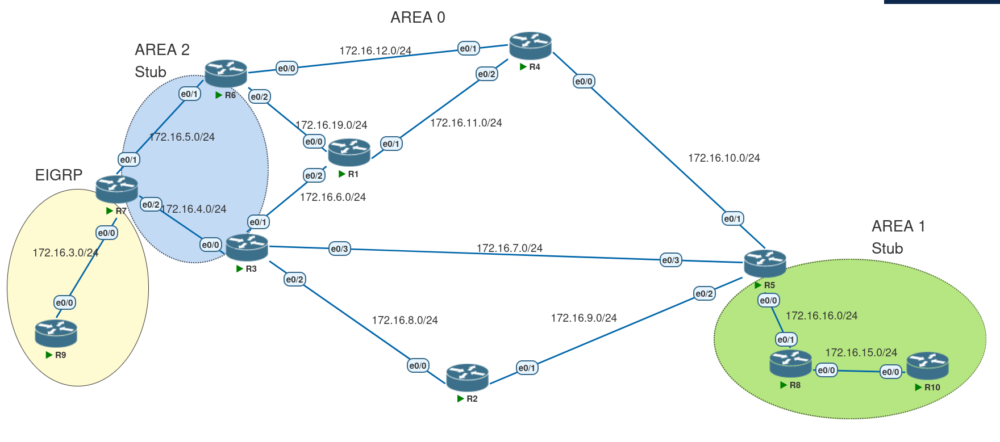

# OSPF — Controlling NSSA Redistribution 



One scenario where the **P bit** would be `0` is when a router inside the NSSA is both an **ABR** and **ASBR** at the same time.

For example, in the topology above, make **R3** advertise a loopback `30.0.0.3/32` into OSPF via redistribution:


In this case R3 would advertise this prefix as an **LSA Type 5** into Area 0 and as an **LSA Type 7** into the NSSA.

### In the NSSA


As we can see the **P bit is off**, which means the translator (in this case **R6**) could not translate it to Area 0.

### In Area 0


---

## NSSA options

### `no-redistribution`

When the router is an NSSA ABR and we want to redistribute routes into Area 0 but **not** into the NSSA itself.

For example, on R3:

```bash
R3(config-router)# area 2 nssa no-redistribution
```

Then R3 would not advertise the `30.0.0.3/32` prefix into the NSSA.

**Notes**

* This is a blanket behavior that applies to *all* prefixes the ABR learns from other areas.
* It is not tied to a specific `redistribute` statement and does **not** provide per-prefix granularity.
* `no-redistribution` is an **area-level** attribute; you cannot say “don’t redistribute `10.0.0.0/8` into the NSSA, but do redistribute `192.168.0.0/16`” using `no-redistribution`.

---

### `nssa-only`

`nssa-only` limits advertisement of prefixes to **only the NSSA** by setting the P bit to zero. This keyword is applied on the **ASBR**.

**Use case**

Consider a topology with an added link between R9 and R2:


We have two exit points to the Internet: one through the NSSA and one through Area 0 (the R2–R9 links represent those exits).

**Policy**

* Routers inside the NSSA should use R9 as the NSSA exit.
* Routers in the rest of the OSPF domain should use R2.

If R2 redistributes the Internet prefixes with a larger metric (so they look less preferable):

```bash
redistribute eigrp 1 metric 200000 subnets
```

you might still see routers choose the path advertised from the NSSA (because metric differences can be overridden by translation behavior). To prevent that, use `nssa-only`.

**Ways to use `nssa-only`**

1. With redistribute:

```bash
redistribute ospf 1 nssa-only
```

2. With summary:

```bash
summary-address x.x.x.x y.y.y.y nssa-only
```

Both commands are applied on the ASBR.

**IOS caveat**

On some IOS versions you can use the `redistribute ... nssa-only` form only once. In those situations:

* Redistribute all subnets (e.g. `redistribute eigrp 1 subnets`) and
* Use `summary-address` to classify and apply `nssa-only` to the specific prefixes you want:

Example on R7:

```bash
redistribute eigrp 1 subnets
summary-address 2.9.2.0 255.255.255.0 nssa-only
```

Now the `2.9.2.0/24` network will not be advertised outside the NSSA because the P bit is off.

On R7 you might see the Type-7 entry like:

```
Type-7 AS External Link States (Area 2)

LS age: 48
Options: (No TOS-capability, No Type 7/5 translation, DC, Upward)
LS Type: AS External Link
Link State ID: 2.9.2.0 (External Network Number )
Advertising Router: 7.7.7.7
LS Seq Number: 80000002
Checksum: 0xD2B3
Length: 36
Network Mask: /24
      Metric Type: 2 (Larger than any link state path)
      MTID: 0
      Metric: 20
      Forward Address: 198.22.10.7
      External Route Tag: 0
```

So regardless of the metric, routers outside the NSSA (e.g. R4) would use R2 as its exit point:

```
R4# traceroute 2.9.2.9
Type escape sequence to abort.
Tracing the route to 2.9.2.9
VRF info: (vrf in name/id, vrf out name/id)
 1 172.16.10.5 0 msec 1 msec 0 msec
 2 172.16.9.2 1 msec 1 msec 1 msec
```

**Warning:** With this scenario we lose redundancy for that prefix — the network is reachable only via the NSSA exit (R9) or only via Area-0 exit (R2) depending how you configure `nssa-only`. Plan for that tradeoff.


