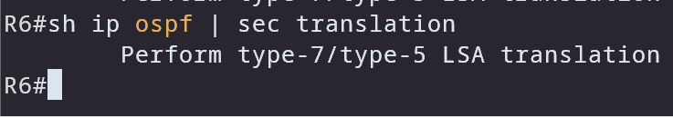
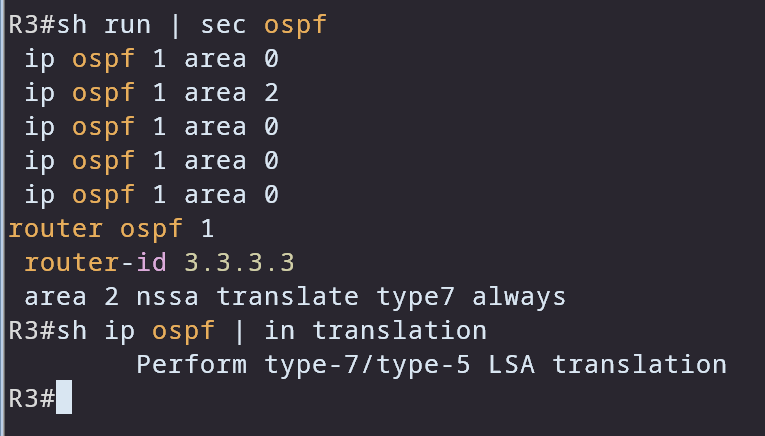
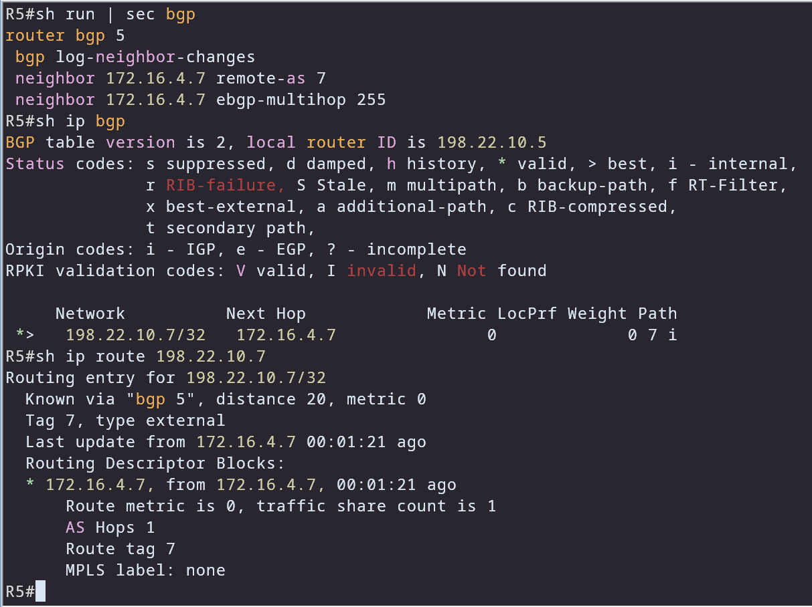
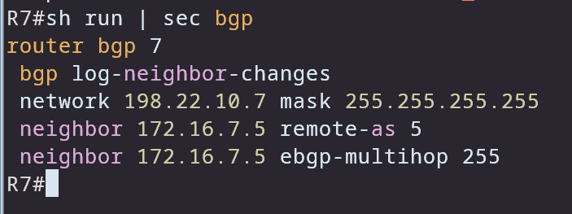

# OSPF — Translator election & Forwarding Address


---

## Translator Election in NSSA

The **NSSA translator election** is based on the highest router ID.  
In this case, **R6** is elected as the translator.

We can verify this in two ways:

- By checking R6’s OSPF process:




- Or by inspecting the **Advertising Router field** in the translated Type-5 LSAs:
```bash
                Type-5 AS External Link States

Link ID         ADV Router      Age         Seq#       Checksum Tag
172.16.1.0      6.6.6.6         553         0x80000002 0x0019C2 0
172.16.2.0      6.6.6.6         553         0x80000002 0x000ECC 0
172.16.3.0      6.6.6.6         553         0x80000002 0x0003D6 0
198.22.10.9     6.6.6.6         553         0x80000002 0x00BFE9 0
R4#
````

### Notes:

* Only **one router** can perform the translation.
* Redundancy is not impacted because of the **Forwarding Address (FA)**.
* To force a specific router to always be the translator, use:

```bash
area 2 nssa translate type7 always
```

For example, configuring this on R3 changes the election:


---

## Forwarding Address (FA) Selection in NSSA

When an ASBR redistributes a route into an NSSA, the **Forwarding Address (FA)** is chosen as follows:

### 1. Check if FA is allowed to be non-zero

* If the ASBR has at least one **non-loopback, non-passive OSPF interface in the NSSA** → FA can be non-zero.
* Otherwise → **FA = 0.0.0.0**.

### 2. If external next-hop is usable

* If the redistributed route has a **next-hop IP** that belongs to an OSPF-active interface in the NSSA,
  → Copy that next-hop IP into the FA field.

### 3. If not, pick an internal address of the ASBR

* Use one of the ASBR’s own OSPF interface addresses inside the NSSA.
* **Preference order (RFC 3101):**

  * First, an **internal OSPF address** (e.g., loopback).
  * Otherwise, an **active OSPF interface address**.

### 4. If no valid choice exists

* FA defaults to **0.0.0.0** → traffic is forwarded directly to the ASBR.

---

## Suppressing the Forwarding Address in NSSA

We can configure the NSSA to always set the FA to **0.0.0.0**.
This is done using:

```bash
area 2 nssa translate type7 suppress-fa
```

> 🔹 Best practice: configure this on the **ASBR**, because if configured on ABRs it must be applied consistently on **all ABRs** to avoid inconsistencies during translator failover.

### Use Case

When the Forwarding Address is learned from a **different routing protocol** (e.g., BGP), OSPF might lose reachability. Suppressing the FA ensures traffic is forwarded using the **Advertising Router** instead.

---

## Example — FA Learned from BGP

Let’s configure eBGP between **R5 and R7**.
R7 advertises its loopback (`198.22.10.7/32`) into BGP, which matches the FA.

* On R5, the OSPF external database shows FA = `198.22.10.7`:

```bash
R5#show ip ospf database external

Link State ID: 172.16.1.0 (External Network Number )
Advertising Router: 3.3.3.3
Metric: 20 
Forward Address: 198.22.10.7
```




Because **eBGP has a lower administrative distance than OSPF**, the FA is installed via BGP, not OSPF.
This causes loss of reachability to the external routes.

```bash
R5#sh ip route 172.16.1.0
% Subnet not in table
R5#ping 172.16.1.9
.....
Success rate is 0 percent (0/5)
```

---

## Fix — Suppressing the Forwarding Address

On the ABR or ASBR, configure:

```bash
R3(config-router)#area 2 nssa translate type7 always suppress-fa
```

Now the FA becomes **0.0.0.0**, and traffic is forwarded via the **Advertising Router**.

```bash
Forward Address: 0.0.0.0
```

SPF then resolves the path back to the ABR (LSA Type-1):

```bash
R5#show ip ospf database router 3.3.3.3
Area Border Router
AS Boundary Router
```

✅ Verification: Reachability is restored.

```bash
R5#ping 172.16.1.9
!!!!!
Success rate is 100 percent (5/5)

R5#show ip route 198.22.10.9
Routing entry for 198.22.10.9/32
Known via "ospf 1", distance 110, metric 20, type extern 2
```

---

## Key Takeaways

* **Translator Election** is based on the highest Router ID, unless overridden with `translate type7 always`.
* **Forwarding Address Selection** follows strict rules defined in RFC 3101.
* **Suppressing FA** ensures stability when the FA is learned via non-OSPF protocols.
* Always verify reachability by checking the OSPF LSDB and the installed routes.


