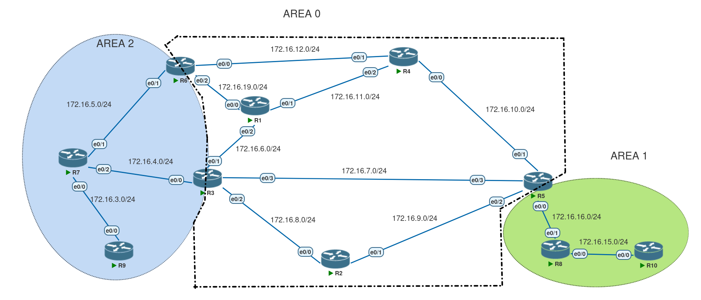

# OSPF — Summarization basic configs :



```ios 
R10#sh run | sec ospf 
router ospf 1
 router-id 10.10.10.10
 network 0.0.0.0 255.255.255.255 area 1
R10#


R9#sh run | sec ospf 
router ospf 1
 router-id 9.9.9.9
 network 0.0.0.0 255.255.255.255 area 2
R9#


R8#sh run | sec ospf 
router ospf 1
 router-id 8.8.8.8
 network 0.0.0.0 255.255.255.255 area 1
R8#


R7#sh run | sec ospf 
router ospf 1
 router-id 7.7.7.7
 network 0.0.0.0 255.255.255.255 area 2
R7#


R6#sh run | sec ospf 
 ip ospf 1 area 0
 ip ospf 1 area 0
 ip ospf 1 area 2
 ip ospf 1 area 0
router ospf 1
 router-id 6.6.6.6
R6#


R5#sh run | sec ospf 
 ip ospf 1 area 0
 ip ospf 1 area 1
 ip ospf 1 area 0
 ip ospf 1 area 0
router ospf 1
 router-id 5.5.5.5
 area 1 stub
R5#


R4#sh run | sec ospf 
router ospf 1
 router-id 4.4.4.4
 network 0.0.0.0 255.255.255.255 area 0
R4#


R3#sh run | sec ospf 
 ip ospf 1 area 0
 ip ospf 1 area 2
 ip ospf 1 area 0
 ip ospf 1 area 0
 ip ospf 1 area 0
router ospf 1
 router-id 3.3.3.3
R3#

R2#sh run | sec ospf 
 ip ospf 1 area 0
 ip ospf 1 area 0
 ip ospf 1 area 0
router ospf 1
 router-id 2.2.2.2
R2#


R1#sh run | sec ospf 
router ospf 1
 router-id 1.1.1.1
 network 0.0.0.0 255.255.255.255 area 0
R1#
```
