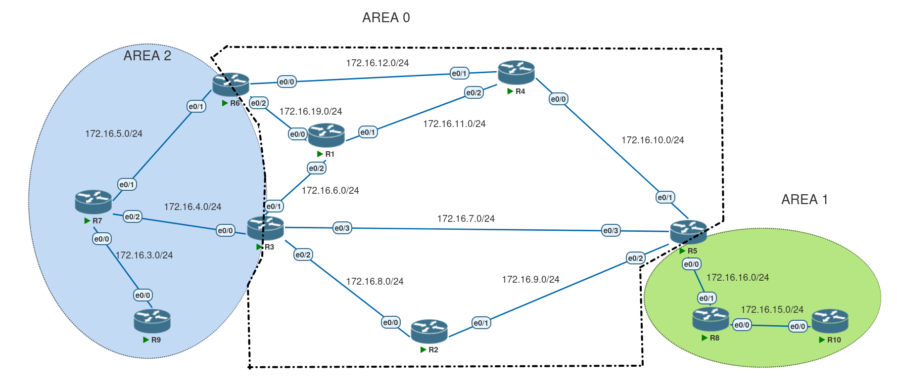

# OSPF — Summarization 



---
## OSPf Scalability :
### 1) Summarize the topology Graph 
* Achieved by ospf area's
* Hides the detail of how the graph looks in other area's
* Only run spf for intra-area destinations

### 2) Summarize the NLRI
* Achieved through stub area's & per-prefix summaries 
* Replaced multiple longer match routes with a shorter match

#### Two approaches to summarization:

1. Per-prefix basis(**this sections focus**)    
2. Per-LSA summarization

---
## Ospf NLRI summarization 
* its different than eigrp or bgp 
#### All Devices in same area must have the same LSDB
* implies summarization can't be performed at arbitrary points in the topology .
#### Ospf summarization can only occure 
* Between internal area's
* Between external domains

#### Eigrp & Bgp win over ospf & IS-IS here :
* eigrp and bgp hierarchy is arbitrary 
* ospf and isis hierarchy is not and it is a strict spine-leaf

---

## ospf Internal vs External Summaries

### internal Summarization :
#### for Inter-Area prefixes
* summarizes Type 1 into Type 3 Lsa's
* Performed on Abr's (in our topology can be R5 R3 R6)
* works on area 0 & none area 0's

###External Summarization :
#### for Inter-Area prefixes
* summarizes Type 5 into Type 5 Lsa's
* summarizes Type 7 into Type 7 Lsa's
* summarizes Type 7 into Type 5 Lsa's

* performed either on the **Asbr** or the ** translator Abr of the nssa **
 (in our case if we declare area 2 as nssa and configure eigrp between R7 and R9 
 then it could either be on R7 (Asbr)
 or it could be on R6/R3 the translator Abr)

---
## Summary Discard Route
#### when summarizing, ospf process automatically creates a local discard route 
 * route to null 0
#### Goal is to drop traffic if longest match is summary 
 * If you are summarizing you should always have a more specific route 
 * End result is that summary route can not fallback to a default route

#### Can be disabled with no ``discard-route`` command 
* If we want to fallback to a default route we should remove the null route using above command 

---

## Where ospf can summarize 
#### Internal Summarization 
* only at the Abr who knows the lsa 1
* can summarize lsa-1 to lsa-3 but can not summarize lsa-3 to lsa-3

#### External Summarization 
* Only at the Asbr/translator Abr who is the originator 
* Asbr performing type-5 or type-7 redistribution 
* Asbr/Abr performing type 5 to type 7 translation 

#### There is no need to memorize this rules, the summary could be done only on the originator of that route 

---
## Configuring ospf Summarization 

#### Internal Summaries :
``area n range x.x.x.x y.y.y.y`` n is the source area 

#### External Summaries :
``summary-address x.x.x.x y.y.y.y``

##### Summarization could also be used for traffic engineering since longer match has more priority than Ad and metric.


## Internal Summarization Example
* in our case we can summarize the prefixes between area 0 and 1 only on R5 
and between area 0 and 2 only on R3 and R6

lets say we want to summarize transit prefixes in area 0 :
```
172.16.6.0/24

172.16.7.0/24

172.16.8.0/24

172.16.9.0/24

172.16.10.0/24

172.16.11.0/24

172.16.12.0/24

172.16.19.0/24
```
6  -> 0000 0110

12 -> 0000 1100

19 -> 0001 0011

* As we can see there is a gap between these prefixes so if would just make a single summary that would include many prefxies :
**172.16.0.0/19**

that would include 172.16.1.0,172.16.2.0,172.16.3.0,172.16.4.0 and so on

so in order to be accurate we should create 2 summaries :
```
172.16.6.0/23

172.16.8.0/22

```

#### 172.16.6.0/23
* covers 172.16.6.0/24 and 172.16.7.0/24

* /23 mask: 255.255.254.0 → block size in 3rd octet = 256 - 254 = 2 (so pairs of /24s).

* Range: 172.16.6.0 — 172.16.7.255.0

* Addresses: 2^(32-23) = 2^9 = 512 (510 usable).

#### 172.16.8.0/22
* covers 172.16.8.0/24, 9.0/24, 10.0/24, 11.0/24

* /22 mask: 255.255.252.0 → block size = 4.

* Range: 172.16.8.0 — 172.16.11.255.

* Addresses: 2^(32-22) = 2^10 = 1024 (1022 usable).

#### And we would left 172.16.12.0/24 and 172.16.19.0/24 

#### commands :
```
 area 0 range 172.16.6.0 255.255.254.0
 area 0 range 172.16.8.0 255.255.252.0
```

##### R8's Rib before summarization 
```
      50.0.0.0/32 is subnetted, 1 subnets
O E2     50.50.50.50 [110/20] via 172.16.16.5, 00:31:22, Ethernet0/1
      172.16.0.0/16 is variably subnetted, 23 subnets, 2 masks
O IA     172.16.1.0/24 [110/60] via 172.16.16.5, 00:31:22, Ethernet0/1
O IA     172.16.2.0/24 [110/60] via 172.16.16.5, 00:31:22, Ethernet0/1
O IA     172.16.3.0/24 [110/50] via 172.16.16.5, 00:31:22, Ethernet0/1
O IA     172.16.4.0/24 [110/40] via 172.16.16.5, 00:31:22, Ethernet0/1
O IA     172.16.5.0/24 [110/40] via 172.16.16.5, 00:31:22, Ethernet0/1
O IA     172.16.6.0/24 [110/40] via 172.16.16.5, 00:01:16, Ethernet0/1
O IA     172.16.7.0/24 [110/40] via 172.16.16.5, 00:01:21, Ethernet0/1
O IA     172.16.8.0/24 [110/30] via 172.16.16.5, 00:01:12, Ethernet0/1
O IA     172.16.9.0/24 [110/20] via 172.16.16.5, 00:01:17, Ethernet0/1
O IA     172.16.10.0/24 [110/20] via 172.16.16.5, 00:01:17, Ethernet0/1
O IA     172.16.11.0/24 [110/30] via 172.16.16.5, 00:01:17, Ethernet0/1
O IA     172.16.12.0/24 [110/30] via 172.16.16.5, 00:31:22, Ethernet0/1
O        172.16.13.0/24 [110/20] via 172.16.15.10, 02:16:29, Ethernet0/0
O        172.16.14.0/24 [110/20] via 172.16.15.10, 02:16:29, Ethernet0/0
O IA     172.16.19.0/24 [110/40] via 172.16.16.5, 00:31:22, Ethernet0/1
      198.22.10.0/32 is subnetted, 10 subnets
O IA     198.22.10.1 [110/31] via 172.16.16.5, 00:31:22, Ethernet0/1
O IA     198.22.10.2 [110/21] via 172.16.16.5, 00:31:22, Ethernet0/1
O IA     198.22.10.3 [110/31] via 172.16.16.5, 00:31:22, Ethernet0/1
O IA     198.22.10.4 [110/21] via 172.16.16.5, 00:31:22, Ethernet0/1
O IA     198.22.10.5 [110/11] via 172.16.16.5, 00:31:22, Ethernet0/1
O IA     198.22.10.6 [110/31] via 172.16.16.5, 00:31:22, Ethernet0/1
O IA     198.22.10.7 [110/41] via 172.16.16.5, 00:31:22, Ethernet0/1
O IA     198.22.10.9 [110/51] via 172.16.16.5, 00:31:22, Ethernet0/1
O        198.22.10.10 [110/11] via 172.16.15.10, 02:16:29, Ethernet0/0
R8#
```

##### R8's Rib after summarization 
```
      50.0.0.0/32 is subnetted, 1 subnets
O E2     50.50.50.50 [110/20] via 172.16.16.5, 00:34:28, Ethernet0/1
      172.16.0.0/16 is variably subnetted, 19 subnets, 4 masks
O IA     172.16.1.0/24 [110/60] via 172.16.16.5, 00:34:28, Ethernet0/1
O IA     172.16.2.0/24 [110/60] via 172.16.16.5, 00:34:28, Ethernet0/1
O IA     172.16.3.0/24 [110/50] via 172.16.16.5, 00:34:28, Ethernet0/1
O IA     172.16.4.0/24 [110/40] via 172.16.16.5, 00:34:28, Ethernet0/1
O IA     172.16.5.0/24 [110/40] via 172.16.16.5, 00:34:28, Ethernet0/1
O IA     172.16.6.0/23 [110/40] via 172.16.16.5, 00:01:57, Ethernet0/1
O IA     172.16.8.0/22 [110/20] via 172.16.16.5, 00:01:57, Ethernet0/1
O IA     172.16.12.0/24 [110/30] via 172.16.16.5, 00:34:28, Ethernet0/1
O        172.16.13.0/24 [110/20] via 172.16.15.10, 02:19:35, Ethernet0/0
O        172.16.14.0/24 [110/20] via 172.16.15.10, 02:19:35, Ethernet0/0
O IA     172.16.19.0/24 [110/40] via 172.16.16.5, 00:34:28, Ethernet0/1
      198.22.10.0/32 is subnetted, 10 subnets
O IA     198.22.10.1 [110/31] via 172.16.16.5, 00:34:28, Ethernet0/1
O IA     198.22.10.2 [110/21] via 172.16.16.5, 00:34:28, Ethernet0/1
O IA     198.22.10.3 [110/31] via 172.16.16.5, 00:34:28, Ethernet0/1
O IA     198.22.10.4 [110/21] via 172.16.16.5, 00:34:28, Ethernet0/1
O IA     198.22.10.5 [110/11] via 172.16.16.5, 00:34:28, Ethernet0/1
O IA     198.22.10.6 [110/31] via 172.16.16.5, 00:34:28, Ethernet0/1
O IA     198.22.10.7 [110/41] via 172.16.16.5, 00:34:28, Ethernet0/1
O IA     198.22.10.9 [110/51] via 172.16.16.5, 00:34:28, Ethernet0/1
O        198.22.10.10 [110/11] via 172.16.15.10, 02:19:35, Ethernet0/0
R8#
```
* as we can see ``172.16.7.0/24`` and ``172.16.9.0/24`` ``172.16.10.0/24`` ``172.16.11.0/24`` are removed 


* we can also summarize the loopbacks :
```
area 0 range 198.22.10.0 255.255.255.0
```
and the routing table would be even smaller :
```
      50.0.0.0/32 is subnetted, 1 subnets
O E2     50.50.50.50 [110/20] via 172.16.16.5, 00:37:42, Ethernet0/1
      172.16.0.0/16 is variably subnetted, 19 subnets, 4 masks
O IA     172.16.1.0/24 [110/50] via 172.16.16.5, 00:03:10, Ethernet0/1
O IA     172.16.2.0/24 [110/50] via 172.16.16.5, 00:03:10, Ethernet0/1
O IA     172.16.3.0/24 [110/40] via 172.16.16.5, 00:03:10, Ethernet0/1
O IA     172.16.4.0/24 [110/30] via 172.16.16.5, 00:03:10, Ethernet0/1
O IA     172.16.5.0/24 [110/40] via 172.16.16.5, 00:37:42, Ethernet0/1
O IA     172.16.6.0/23 [110/20] via 172.16.16.5, 00:03:10, Ethernet0/1
O IA     172.16.8.0/22 [110/20] via 172.16.16.5, 00:05:11, Ethernet0/1
O IA     172.16.12.0/24 [110/30] via 172.16.16.5, 00:37:42, Ethernet0/1
O        172.16.13.0/24 [110/20] via 172.16.15.10, 02:22:49, Ethernet0/0
O        172.16.14.0/24 [110/20] via 172.16.15.10, 02:22:49, Ethernet0/0
O IA     172.16.19.0/24 [110/40] via 172.16.16.5, 00:37:42, Ethernet0/1
      198.22.10.0/24 is variably subnetted, 5 subnets, 2 masks
O IA     198.22.10.0/24 [110/11] via 172.16.16.5, 00:00:05, Ethernet0/1
O IA     198.22.10.7/32 [110/31] via 172.16.16.5, 00:03:10, Ethernet0/1
O IA     198.22.10.9/32 [110/41] via 172.16.16.5, 00:03:10, Ethernet0/1
O        198.22.10.10/32 [110/11] via 172.16.15.10, 02:22:49, Ethernet0/0
R8#
```
* An interesting thing happened here, I entered the command for all loopbacks, but the loopbacks for R7 and R9 are generated in area 2, so R5 does not have visibility to their type 1 LSA, that's why it did not suppress those Lsa's even though they were part of the summary range we created .

* So we can conclude that, our area range command can in fact contain some inter-area routes that the abr does not have visibility to, it just wont suppress them while sending the summary route .

---

#### Discard route 
* as we discussed earlier when a  summary is created, ospf by default would create an entry pointing to null 0 .
on R5 rib "
```
O        198.22.10.0/24 is a summary, 00:05:32, Null0
```
if we want to prevent this and redirect the prefixes to a default route we can use this command :
on R5 :
```
no discard-route
```
now the null entry is removed from R5's Rib.

---

## External Summarization Example
### Normal Area's

* we would summarize on the Asbr that is redistributing the prefixes
* Summarizing on the Abr has no effect and nothing would happen 

lets create some loopbacks to mimic an external domain so R5 can redistribute them :

**on R5**
```
Loopback2                  10.20.2.5       YES manual up                    up      
Loopback3                  10.20.12.5      YES manual up                    up      
Loopback4                  10.20.32.5      YES manual up                    up
```
now we would redistribute them using this command :

```
redistribute connected subnets tag 5555555
```
on R7 :

```
                Type-5 AS External Link States

Link ID         ADV Router      Age         Seq#       Checksum Tag
10.20.2.0       5.5.5.5         125         0x80000001 0x002CC2 5555555
10.20.12.0      5.5.5.5         111         0x80000001 0x00BD27 5555555
10.20.32.0      5.5.5.5         101         0x80000001 0x00E0EF 5555555
50.50.50.50     5.5.5.5         1004        0x80000005 0x00A899 5555555
R7#
```

now we can simply summarize this routes to a  /16 prefix :

```
 summary-address 10.20.0.0 255.255.0.0 tag 5555555
```
‍‍‍now on R7 :
```
                Type-5 AS External Link States

Link ID         ADV Router      Age         Seq#       Checksum Tag
10.20.0.0       5.5.5.5         697         0x80000005 0x003AB2 5555555
50.50.50.50     5.5.5.5         1700        0x80000009 0x00A09D 5555555
R7# 
```
---

### Summarizing in Nssa


Now lets convert area 2 to Nssa using ``area 2 nssa`` on R7,R3,R6

**R7 Configuration**
```
R7#sh run | sec ospf 
router ospf 1
 router-id 7.7.7.7
 area 2 nssa
 redistribute eigrp 1 subnets tag 777777777
 network 172.16.4.0 0.0.0.255 area 2
 network 172.16.5.0 0.0.0.255 area 2
 network 198.22.10.7 0.0.0.0 area 2
R7#
```
**R7 LSDB**

```

            OSPF Router with ID (7.7.7.7) (Process ID 1)

                Router Link States (Area 2)

Link ID         ADV Router      Age         Seq#       Checksum Link count
3.3.3.3         3.3.3.3         87          0x80000017 0x005A0D 1
6.6.6.6         6.6.6.6         98          0x80000018 0x00B395 1
7.7.7.7         7.7.7.7         79          0x80000020 0x00D1BF 3

                Net Link States (Area 2)

Link ID         ADV Router      Age         Seq#       Checksum
172.16.4.7      7.7.7.7         93          0x80000012 0x00DD39
172.16.5.7      7.7.7.7         107         0x80000012 0x0069A0

                Summary Net Link States (Area 2)

Link ID         ADV Router      Age         Seq#       Checksum
172.16.6.0      3.3.3.3         101         0x80000010 0x0053FB
172.16.6.0      6.6.6.6         109         0x80000010 0x005DDB
172.16.7.0      3.3.3.3         101         0x80000010 0x004806
172.16.7.0      6.6.6.6         109         0x80000010 0x00B677
172.16.8.0      3.3.3.3         101         0x80000010 0x003D10
172.16.8.0      6.6.6.6         109         0x80000010 0x00AB81
172.16.9.0      3.3.3.3         101         0x80000010 0x0096AB
172.16.9.0      6.6.6.6         109         0x80000010 0x00A08B
172.16.10.0     3.3.3.3         101         0x80000011 0x0089B6
172.16.10.0     6.6.6.6         109         0x80000010 0x003104
172.16.11.0     3.3.3.3         101         0x80000010 0x0080BF
172.16.11.0     6.6.6.6         109         0x80000010 0x00260E
172.16.12.0     3.3.3.3         101         0x80000010 0x00D95B
172.16.12.0     6.6.6.6         109         0x80000010 0x00B686
172.16.13.0     3.3.3.3         101         0x80000009 0x0041EF
172.16.13.0     6.6.6.6         109         0x80000008 0x004DCE
172.16.14.0     3.3.3.3         101         0x80000009 0x0036F9
172.16.14.0     6.6.6.6         109         0x80000008 0x0042D8
172.16.15.0     3.3.3.3         101         0x80000009 0x00C672
172.16.15.0     6.6.6.6         109         0x80000008 0x00D251
172.16.16.0     3.3.3.3         101         0x80000011 0x0047F2
172.16.16.0     6.6.6.6         109         0x80000010 0x0053D1
172.16.17.0     3.3.3.3         101         0x80000009 0x00B086
172.16.17.0     6.6.6.6         109         0x80000008 0x00BC65
172.16.18.0     3.3.3.3         101         0x80000009 0x00A590
172.16.18.0     6.6.6.6         109         0x80000008 0x00B16F
172.16.19.0     3.3.3.3         101         0x80000010 0x002810
172.16.19.0     6.6.6.6         109         0x80000010 0x0069CC
198.22.10.1     3.3.3.3         101         0x80000010 0x008B9D
198.22.10.1     6.6.6.6         109         0x80000010 0x0031EB
198.22.10.2     3.3.3.3         101         0x80000010 0x0081A6
198.22.10.2     6.6.6.6         109         0x80000010 0x00EF18
198.22.10.3     3.3.3.3         101         0x80000010 0x00131E
198.22.10.3     6.6.6.6         109         0x80000010 0x00818F
198.22.10.4     3.3.3.3         101         0x80000010 0x00D14A
198.22.10.4     6.6.6.6         109         0x80000010 0x001307
198.22.10.5     3.3.3.3         101         0x80000011 0x0061C2
198.22.10.5     6.6.6.6         109         0x80000010 0x006DA1
198.22.10.6     3.3.3.3         101         0x80000010 0x00BD5C
198.22.10.6     6.6.6.6         109         0x80000010 0x009A87
198.22.10.8     3.3.3.3         101         0x80000009 0x00B767
198.22.10.8     6.6.6.6         109         0x80000008 0x00C346
198.22.10.10    3.3.3.3         101         0x80000009 0x00080B
198.22.10.10    6.6.6.6         109         0x80000008 0x0014E9

                Type-7 AS External Link States (Area 2)

Link ID         ADV Router      Age         Seq#       Checksum Tag
172.16.1.0      7.7.7.7         79          0x80000001 0x00EEF1 777777777
172.16.2.0      7.7.7.7         79          0x80000001 0x00E3FB 777777777
172.16.3.0      7.7.7.7         79          0x80000001 0x00D806 777777777
198.22.10.9     7.7.7.7         79          0x80000001 0x009519 777777777
```
we take these three prefixes :
```
172.16.1.0/24
172.16.2.0/24
172.16.3.0/24 
```
and turn them to ``172.16.0.0/22`` using ``R7(config-router)#summary-address 172.16.0.0 255.255.252.0 tag 700000000`` command .

**R7's LSDB after the summarization**
```

                Type-7 AS External Link States (Area 2)

Link ID         ADV Router      Age         Seq#       Checksum Tag
172.16.0.0      7.7.7.7         29          0x80000001 0x0003C5 700000000
198.22.10.9     7.7.7.7         554         0x80000001 0x009519 777777777
```
#### NSSA summarization on the ABR : 
We can also perform the summarization on the Abr , the differenece to the previous method would be the subset prefixes would be visible in the **Nssa** and then be suppressed while translating to **Area 0**

* lets undo the previous summarization by removing the summary-address on R7 :

**R7 Configuration**
```
R7#sh run | sec ospf 
   redistribute ospf 1 metric 555555555 10 255 10 1550
router ospf 1
 router-id 7.7.7.7
 area 2 nssa
 summary-address 172.16.0.0 255.255.252.0 tag 700000000
 redistribute eigrp 1 subnets
 network 172.16.4.0 0.0.0.255 area 2
 network 172.16.5.0 0.0.0.255 area 2
 network 198.22.10.7 0.0.0.0 area 2
R7#
```

**Type 7 Lsa's in the NSSA**
```
                Type-7 AS External Link States (Area 2)

Link ID         ADV Router      Age         Seq#       Checksum Tag
172.16.1.0      7.7.7.7         5           0x80000001 0x006866 0
172.16.2.0      7.7.7.7         5           0x80000001 0x005D70 0
172.16.3.0      7.7.7.7         5           0x80000001 0x00527A 0
198.22.10.9     7.7.7.7         37          0x80000003 0x000B8F 0
R7#
```

**Type 5 Lsa's before summarization in Area 0**

```
                Type-5 AS External Link States

Link ID         ADV Router      Age         Seq#       Checksum Tag
10.20.0.0       5.5.5.5         175         0x80000006 0x0038B3 5555555
50.50.50.50     5.5.5.5         1181        0x8000000A 0x009E9E 5555555
172.16.1.0      6.6.6.6         73          0x80000001 0x001BC1 0
172.16.2.0      6.6.6.6         73          0x80000001 0x0010CB 0
172.16.3.0      6.6.6.6         73          0x80000001 0x0005D5 0
198.22.10.9     6.6.6.6         101         0x80000004 0x00BBEB 0
R2# 
```
* as we can see the ADV Router for translated lsa's is R6, so we apply our summarization commands on R6:

```
R6(config-router)#summary-address 172.16.0.0 255.255.252.0 tag 6666666
```
**Type 7 Lsa's in the NSSA after the summarization on R6**
```
                Type-7 AS External Link States (Area 2)

Link ID         ADV Router      Age         Seq#       Checksum Tag
172.16.1.0      7.7.7.7         219         0x80000001 0x006866 0
172.16.2.0      7.7.7.7         219         0x80000001 0x005D70 0
172.16.3.0      7.7.7.7         219         0x80000001 0x00527A 0
198.22.10.9     7.7.7.7         251         0x80000003 0x000B8F 0
R7#
```
* As we can see there is no change in the area 2 LSDB

**Type 5 Lsa's after summarization in Area 0**

```
                Type-5 AS External Link States

Link ID         ADV Router      Age         Seq#       Checksum Tag
10.20.0.0       5.5.5.5         437         0x80000006 0x0038B3 5555555
50.50.50.50     5.5.5.5         1443        0x8000000A 0x009E9E 5555555
172.16.0.0      6.6.6.6         131         0x80000001 0x004ABA 6666666
198.22.10.9     6.6.6.6         363         0x80000004 0x00BBEB 0
R2#
```
* an interesting fact is, after summarization unlike regular translated type lsa's, the forward address of the summary would be 0.0.0.0
```
R2# sh ip ospf database external 172.16.0.0

            OSPF Router with ID (2.2.2.2) (Process ID 1)

                Type-5 AS External Link States

  LS age: 259
  Options: (No TOS-capability, DC, Upward)
  LS Type: AS External Link
  Link State ID: 172.16.0.0 (External Network Number )
  Advertising Router: 6.6.6.6
  LS Seq Number: 80000001
  Checksum: 0x4ABA
  Length: 36
  Network Mask: /22
        Metric Type: 2 (Larger than any link state path)
        MTID: 0 
        Metric: 20 
        Forward Address: 0.0.0.0
        External Route Tag: 6666666

R2#
```
* its a good practice to apply the summary command on all Abr's of nssa, so if the current translator goes down we would still have the summarization 


